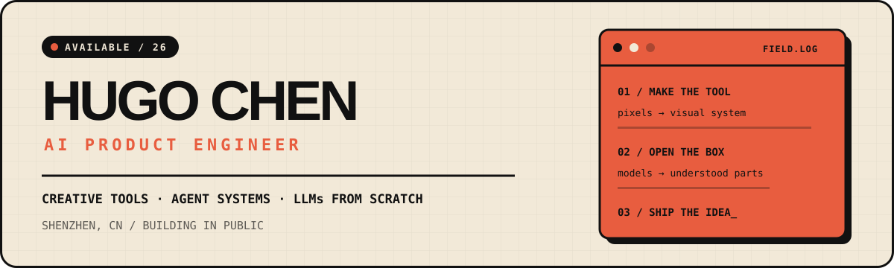

<p align="center">
  
</p>

<p align="center">
  <a href="mailto:yuf427@outlook.com"></a>
  
  <a href="https://github.com/YakiHugo?tab=repositories"></a>
</p>

## Building coding agents from the inside out.

I'm **Hugo Chen**. My current focus is **Yakitori**: a local coding-agent
workbench for exploring the runtime and product boundaries behind modern coding
agents—implemented from first principles, one reviewable module at a time.

I'm especially interested in the parts that turn a model loop into a dependable
product: durable identity, governed memory, tool execution, honest recovery,
and collaboration you can actually inspect.

## Current focus · Yakitori

<table>
  <tr>
    <td width="66%" valign="top">
      <h3>⌁ <a href="https://github.com/YakiHugo/yakitori">Yakitori</a></h3>
      <p><strong>A coding workbench centered on persistent AI teammates.</strong></p>
      <p>Mates can work alone or collaborate in a shared task room, while every execution lane stays inspectable. The project does not wrap an agent framework; it rebuilds the important boundaries directly.</p>
      <p><code>TypeScript</code> <code>Node.js</code> <code>Agent Runtime</code> <code>Local-first</code></p>
    </td>
    <td width="34%" valign="top">
      <p><strong>Now implemented</strong></p>
      <p>Session runtime<br/>SQLite fact log<br/>Mate profiles<br/>Tool + permission flow<br/>HTTP/SSE workbench</p>
      <p><strong>Next</strong></p>
      <p>Rooms · Tasks · Memory<br/>Multi-mate collaboration</p>
    </td>
  </tr>
</table>

## Previous work · TermCanvas

<table>
  <tr>
    <td width="38%" valign="top">
      <h3>▦ <a href="https://github.com/blueberrycongee/termcanvas">TermCanvas</a></h3>
      <p><strong>An infinite-canvas desktop app for visually managing terminals.</strong></p>
      <p><code>Electron</code> <code>TypeScript</code> <code>Canvas UX</code></p>
    </td>
    <td width="62%" valign="top">
      <p>I contributed across the product rather than one isolated feature: canvas and terminal interaction, in-terminal search, WebGL recovery, macOS lifecycle and differential updates, file-tree work, Windows CLI support, and multi-agent workflow experiments.</p>
      <p>This is the earlier project where I did the most substantial product and engineering work.</p>
    </td>
  </tr>
</table>

## Research threads

<table>
  <tr>
    <td width="33%" valign="top">
      <h3>◉ <a href="https://github.com/YakiHugo/coconut">coconut</a></h3>
      <p>Turns podcasts and videos into structured Chinese transcripts you can search and study.</p>
      <p><code>Python</code> <code>WhisperX</code></p>
    </td>
    <td width="34%" valign="top">
      <h3>∿ <a href="https://github.com/YakiHugo/cs336">CS336</a></h3>
      <p>A text-first study log for Stanford's Language Modeling from Scratch course.</p>
      <p><code>PyTorch</code> <code>LLM Systems</code></p>
    </td>
    <td width="33%" valign="top">
      <h3>◇ <a href="https://github.com/YakiHugo/cheungfun">Cheungfun</a></h3>
      <p>An earlier, smaller coding-agent study project that helped lead into Yakitori.</p>
      <p><code>TypeScript</code> <code>Agent Loop</code></p>
    </td>
  </tr>
</table>

## What I optimize for

```text
DURABLE TRUTH           ━━━━━━━━━━━━━━━━━━━  facts over tidy fiction
SYSTEM BOUNDARIES       ━━━━━━━━━━━━━━━━━    Mate ≠ model · Room ≠ Task
RECOVERY                ━━━━━━━━━━━━━━━      idempotency · interruption · repair
BOUNDED AUTONOMY        ━━━━━━━━━━━━━━━━━    permissions · context · wakeups
```

<sub>I prefer narrow interfaces, small reviewable changes, integration-style
tests, and abstractions that earn their place through real callers.</sub>

## Working set

<p>
  
  
  
  
  
  
  
  
</p>

<p>
  <sub>Shanghai, China · Reach me by email or add <strong>EXIAR427</strong> on WeChat. If you're also taking coding agents apart to understand how they work, we'll have plenty to talk about.</sub>
</p>
